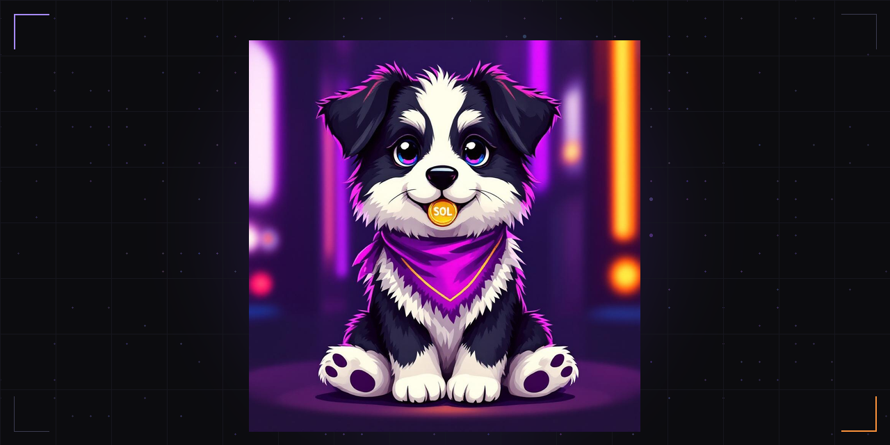
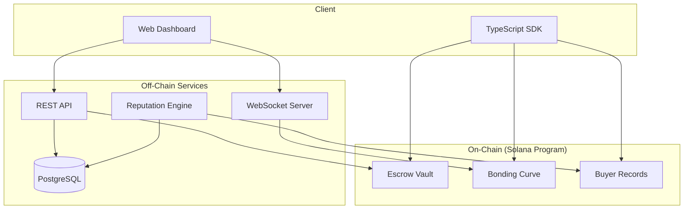

<p align="center">
  
</p>

<p align="center">
  <a href="https://x.com/fyrstfun"></a>
  <a href="https://fyrst.fun"></a>
  
  
</p>

# FYRST Protocol

The first responsible token launchpad on Solana. Launch safe. Buy confident.

## Overview

FYRST Protocol introduces deployer accountability to token launches through mandatory collateral escrow, automated buyer protection, and cross-wallet reputation tracking.

Every deployer must lock SOL collateral into an escrow vault before their token goes live. If the deployer abandons the project or performs a rug pull during the safe period, the collateral is automatically distributed back to affected buyers on a pro-rata basis. Deployers who behave honestly reclaim their collateral after the safe period ends.

## Architecture



## Instructions

| Instruction | Description | Signer |
|---|---|---|
| `create_escrow` | Lock deployer collateral into an escrow vault | Deployer |
| `release_escrow` | Reclaim collateral after safe period ends | Deployer |
| `init_bonding_curve` | Initialize a linear bonding curve for a token | Deployer |
| `buy_tokens` | Purchase tokens on the bonding curve | Buyer |
| `sell_tokens` | Sell tokens back to the bonding curve | Seller |
| `record_buyer` | Record a purchase for refund eligibility | Buyer |
| `process_refund` | Distribute refund from escrow to buyer | Authority |

## Protocol Parameters

| Parameter | Value | Description |
|---|---|---|
| Minimum Collateral | 1 SOL | Minimum escrow deposit required to launch a token |
| Safe Period | 24 hours | Lock duration before deployer can reclaim collateral |
| Trade Fee | 1% | Fee applied to each buy/sell transaction |
| Protocol Fee | 0.5% | Portion of trade fees directed to the protocol |
| Deploy Fee | 0.02 SOL | One-time fee for creating a new token launch |

## Bonding Curve Model

FYRST uses a linear bonding curve for token pricing:

```
price(s) = base_price + slope * current_supply
```

Where:
- `base_price` is the initial token price in lamports
- `slope` determines how quickly the price increases per token sold
- `current_supply` is the total number of tokens currently in circulation

The curve ensures transparent, deterministic pricing where each successive token costs slightly more than the last. A 1% trade fee is applied to both buys and sells, with 0.5% going to the protocol treasury.

## Reputation Scoring

Deployer reputation is calculated using on-chain history:

- **Launch Count**: total tokens deployed
- **Rug Count**: number of launches flagged as rugs
- **Success Rate**: percentage of launches where escrow was cleanly released
- **Collateral History**: average and total collateral deposited

The score is rule-based and updated in real-time as on-chain events occur.

## Getting Started

### Prerequisites

- Rust 1.75+ and Cargo
- Solana CLI 1.18+
- Anchor CLI 0.30+
- Node.js 18+

### Build and Test

```bash
# Clone the repository
git clone https://github.com/fyrst-fun/fyrst.git
cd fyrst

# Build the on-chain program
cd contracts
anchor build

# Run tests
anchor test

# Build the SDK
cd ../sdk
npm install
npm run build
```

### SDK Usage

```typescript
import { FyrstClient } from "@fyrst/sdk";
import { AnchorProvider, BN } from "@coral-xyz/anchor";
import { PublicKey } from "@solana/web3.js";

const provider = AnchorProvider.env();
const client = new FyrstClient(provider, idl);

// Create an escrow with 2 SOL collateral
const tokenMint = new PublicKey("...");
const tx = await client.createEscrow(
  tokenMint,
  new BN(2_000_000_000) // 2 SOL
);

// Initialize a bonding curve
await client.initBondingCurve(
  tokenMint,
  new BN(1_000_000),  // base price: 0.001 SOL
  new BN(100)          // slope: 100 lamports per token
);

// Buy tokens
await client.buyTokens(tokenMint, new BN(100_000_000)); // 0.1 SOL

// Fetch escrow state
const escrow = await client.fetchEscrow(deployer, tokenMint);
console.log("Released:", escrow.released);
console.log("Collateral:", escrow.collateralAmount.toString());
```

## Configuration

| Variable | Description | Default |
|---|---|---|
| `PROGRAM_ID` | On-chain program address | `CcyByKGzRDK17icyNGAgdUN4q7WzbL1BPi4BNzqytyMP` |
| `DEFAULT_RPC` | Solana RPC endpoint | `https://api.devnet.solana.com` |
| `ESCROW_SEED` | PDA seed for escrow accounts | `"escrow"` |
| `CURVE_SEED` | PDA seed for bonding curve accounts | `"curve"` |
| `RECORD_SEED` | PDA seed for buyer record accounts | `"record"` |


The program is currently deployed on Solana Devnet:

```
Program ID: CcyByKGzRDK17icyNGAgdUN4q7WzbL1BPi4BNzqytyMP
```

## Security

This software is unaudited and provided as-is. It is currently deployed on devnet for testing purposes only. Do not use with real funds on mainnet. If you discover a vulnerability, please report it privately to the team.

## License

[MIT](LICENSE)
